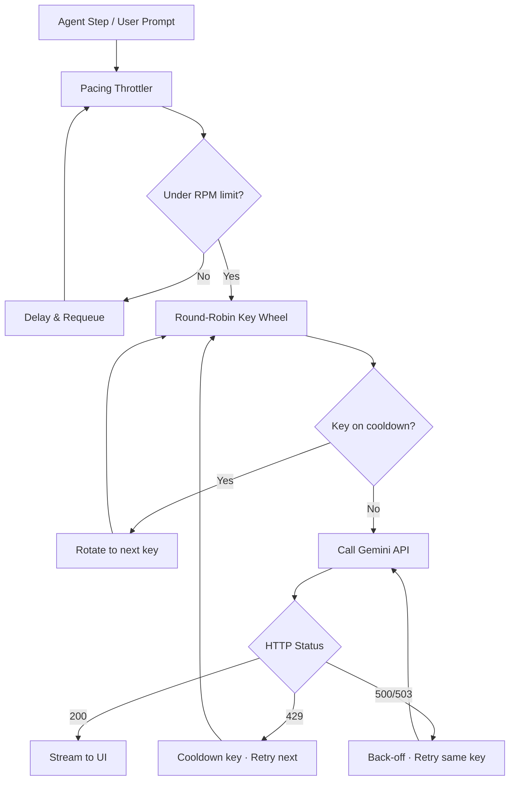

# ⚡ Flash Code

<p align="center">
  
</p>

<p align="center">
  <a href="https://marketplace.visualstudio.com/"></a>
  <a href="https://opensource.org/licenses/MIT"></a>
  <a href="https://ai.google.dev/"></a>
  <a href="https://ollama.com/"></a>
</p>

<p align="center">
  <strong>An open-source, autonomous AI coding assistant for VS Code — powered by Gemini &amp; Ollama.</strong><br/>
  Claude Code-style agentic loops · Round-robin multi-key rate-limit bypass · Parallel subagents · Beautiful diff viewer
</p>

---

## ✨ What is Flash Code?

Flash Code is a **production-grade AI coding assistant** that lives inside VS Code. It goes far beyond simple autocomplete or single-turn chat — it runs fully autonomous agent loops, delegates tasks to specialized subagents, reads and writes files, executes terminal commands, and presents changes in a beautiful, Git-style diff viewer — all for **free**, using Gemini's free-tier API.

---

## 🚀 Key Features

### 🤖 Autonomous Agentic Loops
Give Flash Code a high-level goal and it will break it down into a task list, read your codebase, plan a solution, write/edit/delete files, run terminal commands, read outputs, and fix errors — all without hand-holding. Powered by a real tool-call loop with live streaming output.

### 🔑 Multi-Key Rate-Limit Bypass
Connect **multiple free-tier Gemini API keys**. Flash Code manages a round-robin key wheel with:
- **Per-key pacing** — throttles requests to stay safely under the 15 RPM free-tier limit.
- **Smart cooldowns** — when a key receives a `429 Rate Limit`, it is placed on a timed cooldown and the current request is instantly rerouted to the next healthy key.
- **Automatic retry** — `500`/`503` overload responses trigger a back-off-and-retry on the same key.

### 👥 Parallel Subagents
Complex tasks are automatically split and delegated to specialized background workers that run concurrently:

| Agent | Role |
|-------|------|
| 🔍 **Scout** | Deep codebase exploration, API research, dependency analysis |
| 🧪 **QA Engineer** | Writing and running tests, verifying correctness |
| 🧹 **Code Auditor** | Linting, style enforcement, dead code removal |
| 🏗️ **Architect** | High-level redesigns and large refactoring tasks |

### 💬 Four Chat Modes

| Mode | Behaviour |
|------|-----------|
| **Ask Before Edit** | Review every file change in a diff viewer before it is applied |
| **Auto Edit** | Apply changes to disk instantly, no confirmation needed |
| **Plan** | Discuss architecture and produce markdown plans, no file writes |
| **Autonomous** | Full agent loop — plans, codes, tests, and fixes in one shot |

### 🖥️ IDE-Style Diff Viewer
Changes are shown in a sleek, **single-pane diff view** inspired by Git:
- 🟥 **Removed lines** in red · 🟩 **Added lines** in green
- **Expand / Collapse** — new files show the first 25 lines by default with a one-click expand button
- **Multi-hunk view** — for edits touching multiple regions of a file, each hunk is shown separately with a visual gap indicator (`··· N lines ···`) so you always know where in the file the change lives

### 🌐 Production-Quality Web Generation
When asked to create a website or web UI, Flash Code generates **premium, production-ready code** — not boilerplate. Enforced standards include:
- Modern Google Fonts, curated color palettes, dark mode
- Glassmorphism, smooth gradients, micro-animations
- Semantic HTML5, full SEO meta tags, responsive layouts
- Zero placeholder images — real visual content generated automatically

### ⚙️ Terminal Command Execution
The agent can run non-interactive shell commands (`npm install`, `tsc`, test runners, linters) directly inside your workspace, parse stdout/stderr, and automatically fix any errors it finds.

### 📦 Smart Context Compaction
When conversation history grows large, Flash Code automatically compresses older turns into a concise summary — keeping the agent sharp, cheap to run, and within context window limits.

### 🎛️ Effort Slider
Five thinking budget levels (`Low` → `Medium` → `High` → `xHigh` → `Max`) let you trade off speed vs. thoroughness per task.

### 🦙 Ollama Integration
Run fully **local, private** coding models (e.g. `qwen2.5-coder`, `llama3`) with automatic fallback to Gemini if Ollama goes offline.

---

## 🏗️ Architecture Overview

```
User Prompt
    │
    ▼
┌──────────────────────────────────┐
│         Chat Panel (UI)          │  ← 4 modes: Ask / Auto / Plan / Auto
│  Streams live tokens to webview  │
└────────────┬─────────────────────┘
             │
    ┌─────────▼──────────┐
    │   Agent Runner     │  ← tool-call loop: read, write, search, run
    │  (agentRunner.ts)  │
    └─────────┬──────────┘
              │  spawns parallel workers
    ┌─────────▼──────────┐
    │  Subagent Registry  │  ← Scout | QA Engineer | Code Auditor | Architect
    └─────────┬──────────┘
              │
    ┌─────────▼──────────┐
    │   Backend Manager  │  ← Gemini (multi-key) · Ollama (local)
    └────────────────────┘
```

### Multi-Key Request Flow



---

## 📦 Installation

### Prerequisites

- [Node.js](https://nodejs.org/) v18 or higher
- [VS Code](https://code.visualstudio.com/) v1.85.0 or higher

### Build & Install from Source

```bash
# 1. Clone the repository
git clone https://github.com/apssmandal/Flash-Code.git
cd Flash-Code

# 2. Install dependencies
npm install

# 3. Compile TypeScript
npm run compile

# 4. Package the extension
npx @vscode/vsce package --allow-missing-repository

# 5. Install the .vsix in VS Code
code --install-extension flash-code-2.0.0.vsix
```

> **VS Code UI**: Open Extensions (`Ctrl+Shift+X`) → `···` menu → **Install from VSIX…** → select the `.vsix` file.

---

## ⚙️ Configuration

Press **`Ctrl+Shift+A`** (or **`Cmd+Shift+A`** on Mac) to open Flash Code, then click the **Gear icon ⚙** to configure:

| Setting | Description |
|---------|-------------|
| `flashCode.gemini.apiKeys` | Array of free-tier Gemini API keys for round-robin rotation |
| `flashCode.gemini.model` | Active Gemini model (`gemini-2.5-flash`, etc.) |
| `flashCode.ollama.url` | Ollama server URL (default: `http://localhost:11434`) |
| `flashCode.ollama.model` | Local model name (e.g. `qwen3-coder`) |
| `flashCode.mode` | Default chat mode (`ask`, `auto-edit`, `plan`, `autonomous`) |
| `flashCode.effort` | Default effort level (`low` · `medium` · `high` · `xhigh` · `max`) |
| `flashCode.rateLimit.requestsPerMinute` | Global RPM cap across all keys (default: `15`) |

> Get free Gemini API keys at [Google AI Studio](https://aistudio.google.com/).

---

## 💬 Slash Commands

Type `/` in the chat input to access shortcuts:

| Command | Action |
|---------|--------|
| `/new` | Start a fresh session |
| `/clear` | Clear current session history |
| `/compact` | Compress history into a summary to save tokens |
| `/file` | Inject the active editor file as context |
| `/context` | Pick any workspace file to add as context |
| `/ask` · `/plan` · `/auto` | Switch chat mode |
| `/model` | Quick-switch Gemini model |
| `/effort` | Toggle reasoning budget |

---

## 📂 Project Structure

```
flash-code/
├── src/
│   ├── extension.ts          # Extension entry point & command registration
│   ├── chatPanel.ts          # Webview panel, message routing, mode switching
│   ├── agentRunner.ts        # Core agentic tool-call loop
│   ├── taskOrchestrator.ts   # Task planning, delegation & progress tracking
│   ├── prompts.ts            # All system prompts & WEB_DESIGN_DIRECTIVES
│   ├── rulesEngine.ts        # .flash/rules.md project-level rule loader
│   ├── sessionProvider.ts    # Session persistence & sidebar tree
│   ├── sidebarProvider.ts    # VS Code sidebar webview provider
│   ├── fileManager.ts        # Workspace file read/write utilities
│   ├── diffUtils.ts          # Unified diff parsing & hunk extraction
│   ├── editUtils.ts          # Patch application & conflict detection
│   ├── gitUtils.ts           # Git status, staging & diff helpers
│   ├── storage.ts            # Extension state persistence
│   ├── dashboardPanel.ts     # Mission Control dashboard webview
│   ├── agent/
│   │   ├── agentCore.ts      # Shared agent base types
│   │   └── types.ts          # Tool call & message type definitions
│   ├── backends/
│   │   ├── backendManager.ts # Backend switcher (Gemini ↔ Ollama)
│   │   ├── gemini.ts         # Gemini client with multi-key wheel & pacing
│   │   ├── ollama.ts         # Ollama streaming client
│   │   └── types.ts          # Backend interface types
│   └── subagents/
│       └── registry.ts       # Subagent profiles (Scout, QA, Auditor, Architect)
├── media/
│   ├── chat.html             # Main chat UI webview
│   ├── sidebar.html          # Session list sidebar webview
│   └── dashboard.html        # Mission Control dashboard
├── resources/
│   ├── icon.png              # Extension icon (PNG)
│   ├── icon.svg              # Extension icon (SVG)
│   └── logo_main.svg         # Brand logo
├── LICENSE
├── package.json              # Extension manifest & VS Code contributions
├── tsconfig.json             # TypeScript compiler config
└── .gitignore
```

---

## 🤝 Contributing

Contributions are welcome! To get started:

1. Fork the repository and create a feature branch.
2. Run `npm run watch` for continuous compilation during development.
3. Press `F5` in VS Code to launch the Extension Development Host.
4. Open a Pull Request with a clear description of your changes.

Please open an issue first for significant feature changes so we can discuss the approach.

---

## 📄 License

**MIT** — free to use, modify, and distribute.

*Developed with ❤️ by **Arpan Mandal**.*
