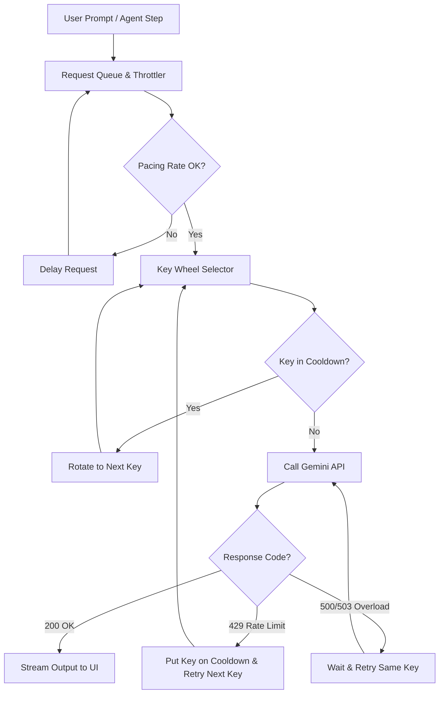

# ⚡ Flash Code

[](https://marketplace.visualstudio.com/)
[](https://opensource.org/licenses/MIT)
[](https://ai.google.dev/)
[](https://ollama.com/)

**Flash Code** is an open-source, Claude Code-style autonomous AI coding assistant running directly inside VS Code. It is built to offer **high-efficiency, zero-cost coding** by leveraging Gemini's powerful free-tier models without hitting rate limits. By multiplexing a pool of multiple Gemini API keys in a smart round-robin wheel, it handles request throttling, rate-limit cooldowns, and automatic recovery seamlessly.

---

## 🚀 Key Features

* **Multi-Key Rate-Limit Bypass**: Connect multiple free-tier Gemini API keys. Flash Code automatically rotates through keys in a round-robin cycle, throttling requests to respect free-tier RPM limits, and marking keys for cooldowns if they receive a `429 Rate Limit` response.
* **Autonomous Agent Loop (Auto Mode)**: Ask a goal, and watch the agent create a task list, read/search/edit files, run tool loops, and stream results live.
* **Subagents & Delegation**: Complex tasks are automatically broken down and delegated to specialized background subagents (Researcher, Tester, Linter, Refactorer) who run their own autonomous loops in parallel.
* **Terminal Command Execution**: The agent can run non-interactive terminal commands (like compiling, linting, running tests) directly within your workspace and parse the outputs to automatically fix errors.
* **Interactive Chat Modes**: 
  * **Ask before edit**: Review file changes side-by-side (red/green diff cards) before they are written to disk.
  * **Edit automatically**: Applies file modifications instantly.
  * **Plan mode**: Discuss architecture, design patterns, and output markdown plans without writing files.
* **Smart Context Compaction**: Automatically summarizes older parts of the conversation to save context window space and reduce token usage, keeping the agent responsive and cheap to run.
* **Effort Slider**: Adjust the agent's thinking budget and token limit (`Low`, `Medium`, `High`, `xHigh`, `Max`) based on the difficulty of the task.
* **Ollama Integration**: Run local, private coding models (like `qwen2.5-coder` or `llama3`) with automatic fallback to Gemini if Ollama goes offline.

---

## 🛠️ How It Works (Multi-Key Architecture)

Flash Code manages API requests through a client-side pacing queue and a round-robin key manager. Here is the request flow:



* **Pacing Throttler**: Restricts average query rates per key to slightly under 15 RPM to avoid trigger-happy rate limiters.
* **Smart Cooldowns**: If a key gets hit with a `429`, Flash Code places it on a dynamic cooldown and immediately redirects the current query to the next available key in the wheel, maintaining uninterrupted developer flow.

---

## 📦 Setup & Installation

### Prerequisites

* [Node.js](https://nodejs.org/) (v18 or higher)
* [VS Code](https://code.visualstudio.com/) (v1.85.0 or higher)

### Build and Package Locally

1. Clone this repository and navigate into the folder:
   ```bash
   git clone https://github.com/yourusername/flash-code.git
   cd flash-code
   ```
2. Install dependencies:
   ```bash
   npm install
   ```
3. Compile the TypeScript code:
   ```bash
   npm run compile
   ```
4. Package the extension to a `.vsix` file:
   ```bash
   npx @vscode/vsce package --allow-missing-repository
   ```
5. Install the generated `.vsix` extension in VS Code:
   * **CLI**: `code --install-extension flash-code-1.0.0.vsix`
   * **VS Code UI**: Open the Extensions view (`Ctrl+Shift+X`), click the `...` menu in the top-right, select **Install from VSIX...**, and pick the `.vsix` file.

---

## ⚙️ Configuration

1. Press **Ctrl+Shift+A** (or **Cmd+Shift+A** on Mac) to open the Flash Code panel.
2. Click the **Gear icon (⚙)** in the sidebar view.
3. Add one or more Gemini API keys (obtainable for free from the [Google AI Studio](https://aistudio.google.com/)).
4. (Optional) Set up Ollama by ensuring it is running locally (`http://localhost:11434`) and choose your model.

### Available Slash Commands

Type `/` in the chat input for shortcuts:
* `/new` — Start a fresh workspace chat session.
* `/clear` — Clear history of the active session.
* `/compact` — Compress the current chat history into a summary to save tokens.
* `/file` — Send the contents of the currently active editor file as context.
* `/context` — Select and add any workspace file to the chat context.
* `/ask` / `/plan` / `/auto` — Switch interaction modes.
* `/model` — Quick-switch between Gemini models.
* `/effort` — Toggle the reasoning and token effort levels.

---

## 🤝 Contributing

We welcome contributions to make Flash Code even more efficient! Feel free to:
- Open issues for bug reports or feature requests.
- Submit Pull Requests to improve the agent loops, UI, or key throttling strategies.

*Developed by **Arpan Mandal**.*

License: **MIT**
